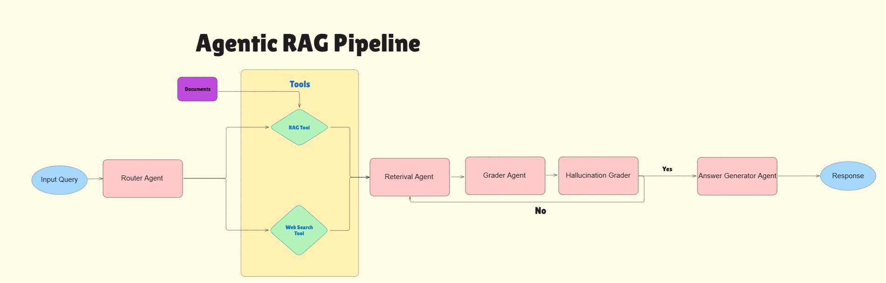

# Agentic-RAG-Application-DeepSeek

## Overview
Agentic RAG is a project focused on developing a Retrieval-Augmented Generation (RAG) system with agentic capabilities. This system aims to enhance the retrieval and generation of information by incorporating intelligent agent behaviors.



## Features
- **Intelligent Retrieval**: Efficiently retrieves relevant information from large datasets.
- **Enhanced Generation**: Generates coherent and contextually appropriate responses.
- **Agentic Capabilities**: Incorporates agent behaviors to improve interaction and decision-making.

## Installation
To install the necessary dependencies, run:
```bash
pip install -r requirements.txt
```

## Usage
To use the Agentic RAG system, follow these steps:
1. Clone the repository:
    ```bash
    git clone https://github.com/ebemad/Agentic-RAG-App.git
    ```
2. Navigate to the project directory:
    ```bash
    cd Agentic-RAG-App
    ```
3. Run the main script:
    ```bash
    python main.py
    ```

